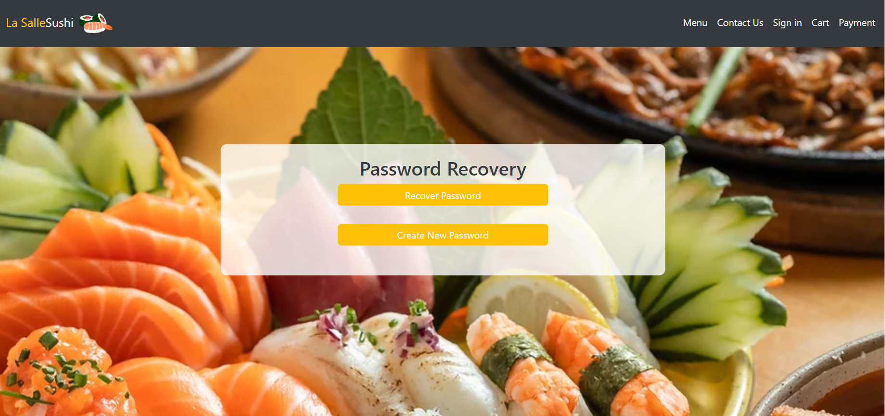

# LaSalleSushi Project  🍣🍤

La Salle Sushi E-commerce Website
Welcome to the La Salle Sushi E-commerce website! This project showcases a fully functional e-commerce platform designed specifically for a sushi restaurant named "La Salle Sushi."

## Technologies 🖥️
The website is built using HTML and JavaScript.

## Features ⚡

- User Registration and Sign In: Users can create accounts by filling out registration forms and sign in securely.
- Password Recovery Page: In case users forget their passwords, they can easily recover them through the password recovery page.
- Menu -> Sushi and Drinks Selection: Explore a wide range of sushi options and drinks available on the menu. Simply add them to your cart for a convenient ordering experience.
- Responsive Design: The website is designed to be responsive, ensuring seamless user experience across various devices and screen sizes.
- Payment Options: Add credit card for payment for ease of checkout.
- Contact Us Page: Reach out to us effortlessly through the Contact Us page, featuring clickable images for quick access to relevant information.
  
Feel free to explore the website and enjoy a seamless sushi ordering experience at La Salle Sushi!

Happy sushi shopping! 🍣🥢

## :camera_flash: Screenshots
<<<<<<< HEAD

&emsp;&emsp;
=======
<!-- You can add more screenshots here if you like -->

>>>>>>> 96b09de4b92bf19fba91d93a8b200e46abb997c7

## Author
Jéssica Máximo de Souza 

🔗https://www.linkedin.com/in/j%C3%A9ssica-m%C3%A1ximo-b65467115/
